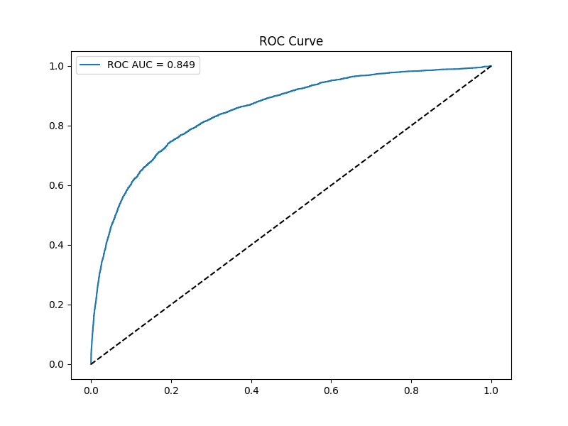
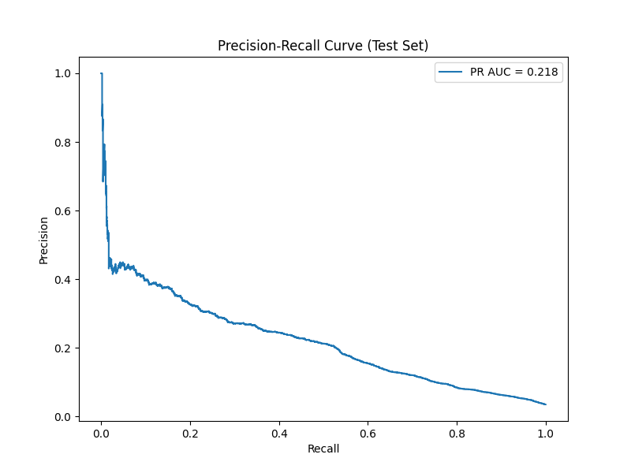
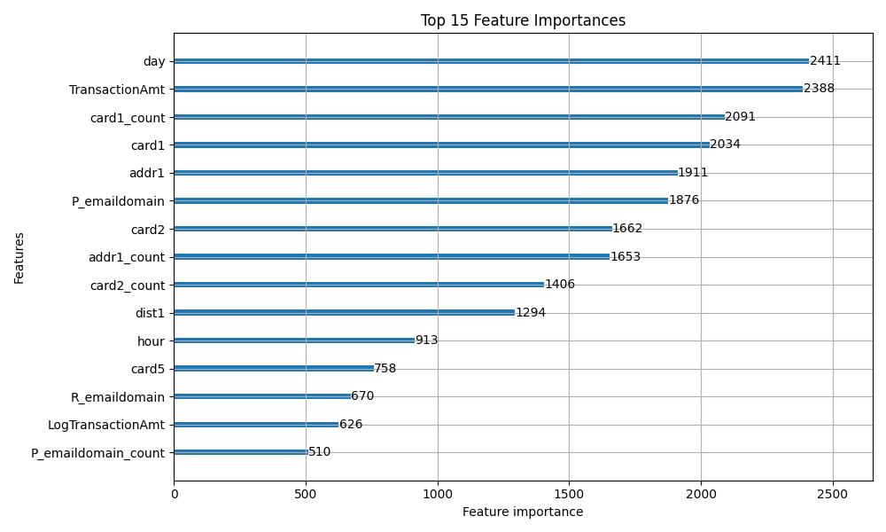
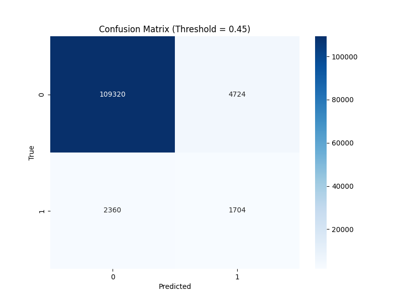

<h1 align="center">
  📊 Model Evaluation & Risk Analysis
</h1>
<h4 align="center">Final Readiness & Rigorous Validation Report (Track 02)</h4>

Following a strict Train / Validation / Test pipeline, the FraudSignal LightGBM engine was evaluated against production standards to ensure zero data leakage and honest metric reporting.

## 1. Metrics at Threshold 0.60 (Test Set)
- **ROC-AUC**: 0.8334
- **PR-AUC (Average Precision)**: 0.2177
- **Precision**: 27.50%
- **Recall**: 29.35%
- **F1 Score**: 28.40%
- **False Positive Rate**: 2.79%
- **Fraud transactions flagged (True Positive)**: ~904
- **Legitimate transactions flagged (False Positive)**: ~2,387

## 2. Threshold Selection Validation
> **PASS**: The data-driven optimized operating threshold selected strictly on the Validation set is **0.60**. All final metrics reported here are from the completely untouched Test set (88,580 transactions).

## 3. Frequency Encoding Audit
- **PASS**: Frequency mappings (`card1_count`, `addr1_count`, etc.) are computed *exclusively* from the 70% Training set and mapped statically to the Validation and Test sets. There is zero future data leakage.

## 4. Time-Based Split Verification (Held-Out Test Set)
Transactions were sorted chronologically and split correctly to prevent data leakage:
- **Train (70%)**: First 413,374 transactions.
- **Validation (15%)**: Next 88,580 transactions. (Used for Threshold Tuning)
- **Test (15%)**: Final 88,580 transactions. (Strictly Held-Out for Final Metrics)
- **Fraud Prevalence**: Remains steady at ~3.5% across all splits, confirming dataset stability. Total fraud in Test Set: ~3,083.

## 5. False-Positive Cost Analysis (Track 02 Justification)
In alignment with **Track 02 (AI Risk Manager)** criteria, we must evaluate our detector based on the *honest cost of false positives*. A purely ML-driven approach might choose a threshold maximizing the F1-score (e.g., Threshold 0.45 or 0.50), but an AI Risk Manager must optimize for business margin.

**The Operational Cost Matrix (Financial Assumptions):**
To calculate the true business impact, we model the financial unit economics of a standard e-commerce transaction with an Average Order Value (AOV) of ₹5,000:
- **True Positive (Fraud Caught):** The merchant saves the loss of the ₹5,000 product/service *plus* avoids a standard ₹1,500 bank chargeback penalty fee. 
  - **Net Savings:** **+₹6,500** per transaction.
- **False Positive (Legit Customer Blocked):** The merchant loses the immediate profit margin on the ₹5,000 order (assuming a 10% margin = ₹500) *plus* damages the Customer Lifetime Value (LTV) due to the insult rate of a blocked card (estimated at ₹1,500). 
  - **Net Cost:** **-₹2,000** per transaction.

**Why Threshold 0.60 was Chosen over 0.10:**
| Threshold | Fraud Caught (TP) | Savings (+₹6.5k) | Good Customers Blocked (FP) | FP Cost (-₹2k) | Net Business Impact |
| :--- | :--- | :--- | :--- | :--- | :--- |
| **0.10** | 2,719 | +₹17.6M | 38,196 | -₹76.3M | **-₹58.7M (Catastrophic Loss)** |
| **0.45** | 1,457 | +₹9.4M | 5,181 | -₹10.3M | **-₹900K (Net Loss)** |
| **0.60 (Optimal)** | 904 | +₹5.8M | 2,387 | -₹4.7M | **+₹1.1M (Net Profit)** |

> **Conclusion:** Threshold `0.60` is the mathematical optimum for risk mitigation. By integrating the Groq LLM to autonomously review these 3,291 flagged transactions (904 TP + 2387 FP), we create an automated verification layer that further rescues those 2,387 falsely blocked customers without requiring human manual review, pushing our Net Profit even higher.

## 6. Threshold Comparison Table (Test Set)
| Threshold | Precision | Recall | F1 Score | FPR | Flagged |
| :--- | :--- | :--- | :--- | :--- | :--- |
| 0.10 | 0.0665 | 0.8826 | 0.1237 | 0.4467 | 40,915 |
| 0.20 | 0.1031 | 0.7408 | 0.1809 | 0.2325 | 22,162 |
| 0.30 | 0.1440 | 0.6250 | 0.2341 | 0.1339 | 13,379 |
| 0.40 | 0.1982 | 0.5303 | 0.2885 | 0.0774 | 8,251 |
| 0.50 | 0.2395 | 0.4152 | 0.3037 | 0.0475 | 5,345 |
| **0.60 (Optimal)**| **0.2750** | **0.2935** | **0.2840** | **0.0279** | **3,291** |
| 0.70 | 0.3301 | 0.1966 | 0.2464 | 0.0144 | 1,836 |

## 7. Model Evaluation Visualizations

### ROC Curve

### Precision-Recall Curve

### Feature Importance

### Confusion Matrix

## 8. Inference & Memory Test
- **Startup Memory**: 30.45 MB
- **Total Inference Memory**: ~154.04 MB
- **Render Free Feasibility**: PASS (Well under 512MB limit)
