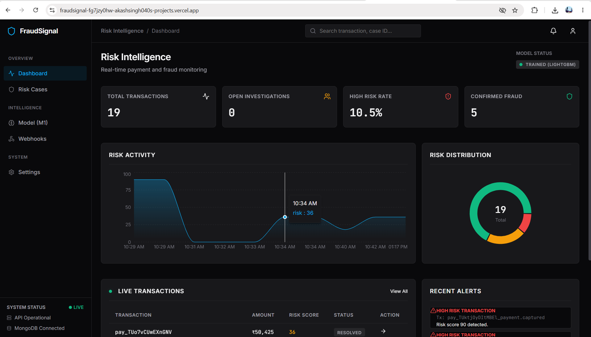
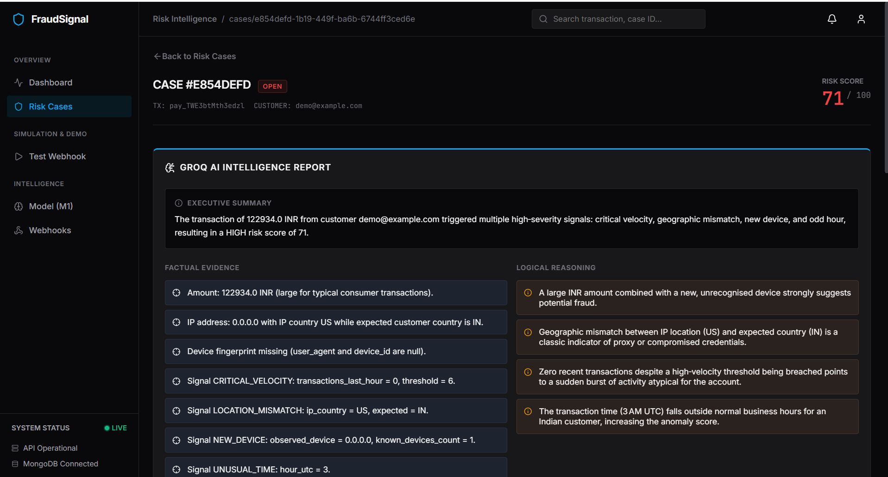
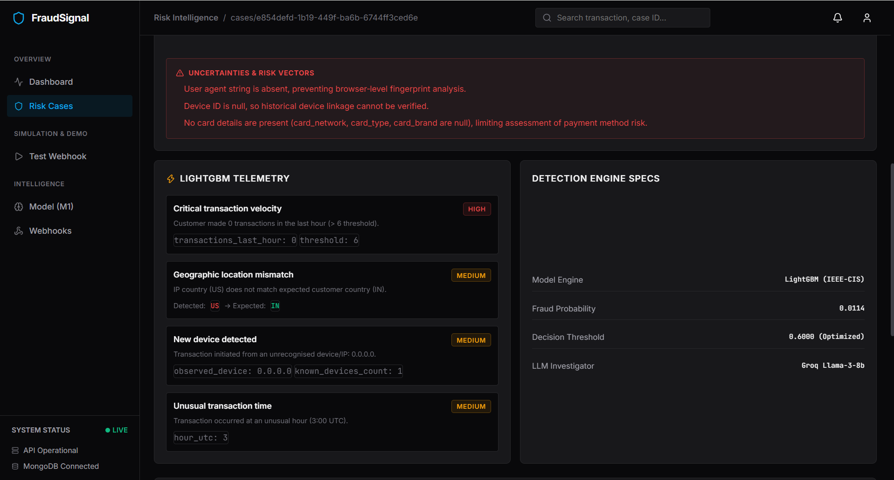
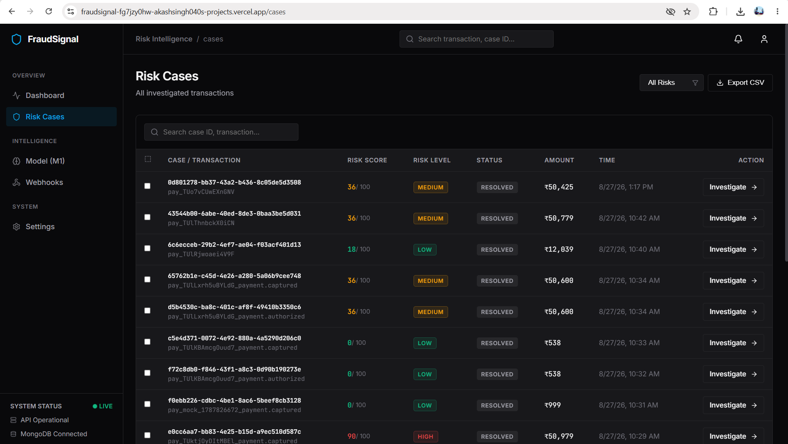
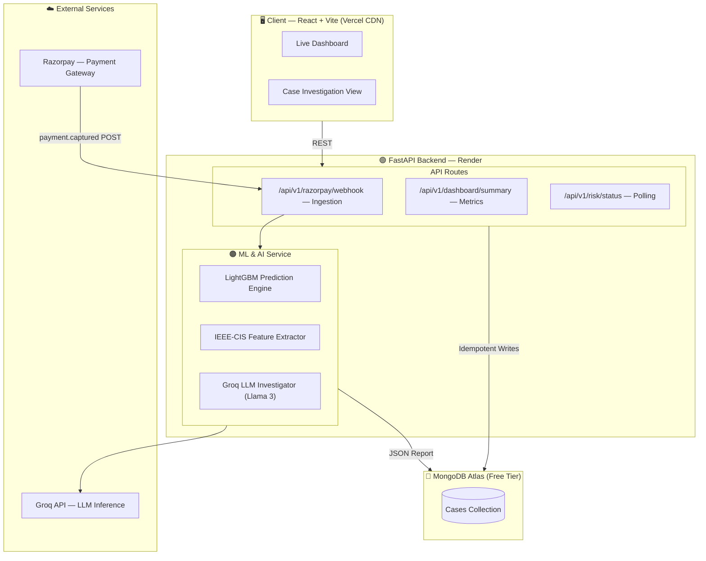
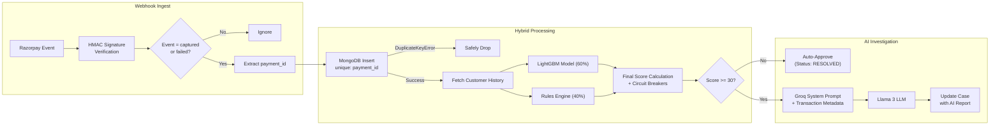

# 🛡️ FraudSignal V1.0

<div align="center">


**An AI-powered real-time transaction fraud detection and automated investigation platform that combines Machine Learning and Generative AI — all in a single full-stack application.**

[🚀 Live Demo](https://fraudsignal.vercel.app)

</div>

---

## 🏆 Hackathon Track 02: AI Risk Manager

FraudSignal directly tackles the core objective: **Stop the merchant from losing money to fraud and chargebacks.** 

It features a working **Fraud-Spike Detector** (LightGBM) and an **Auto-Responder/Verifier** (Groq LLM). The entire system is strictly defense-only and was evaluated using honest, business-first metrics—including a comprehensive **False-Positive Cost Analysis**—measured against a strictly held-out test set.

👉 **[Read the Full False-Positive Cost & Model Evaluation Report Here](MODEL_EVALUATION.md)**

---

## 🚀 Overview

FraudSignal is a **modern, microservices-based** fraud detection platform built for scaling e-commerce and fintech applications. It solves massive operational bottlenecks in payment processing:

| Problem | Solution |
|---------|----------|
| False Negatives on Edge Cases | **Hybrid Engine** combining LightGBM (60%) with deterministic Rules (40%) |
| Manual Investigation Bottleneck | **Groq LLM Investigator** autonomously reviews flagged cases |
| Silent Anomalies | **Circuit Breaker Logic** sets strict risk floors based on transaction history and velocity |
| Duplicate Webhook Processing | **Strict Idempotency** via MongoDB unique indexes |

The platform seamlessly intercepts **Razorpay** webhooks, evaluates them mathematically in milliseconds, and pushes high-risk AI-investigated cases to a React dashboard in real-time.

---

## 📸 Screenshots

### 🏠 Live Dashboard

<p align="center">
  
</p>

---

### 🕵️‍♂️ AI Case Investigation

<p align="center">
  
</p>

<p align="center">
  
</p>

---

### 🚨 Risk Cases

<p align="center">
  
</p>
---

## ✨ Features

### 🧠 Hybrid Risk Engine (LightGBM + Rules)
- Evaluates transactions using a **60/40 weighted split**: 60% driven by LightGBM machine learning, 40% driven by a deterministic Rules Engine.
- **Circuit Breaker Floors**: Automatically overrides low ML probabilities if severe anomalies (like extreme velocity or geographic IP mismatch) are detected.
- Converts raw Razorpay JSON strings into structured Pandas dataframes instantly via forced float casting.

### 🤖 AI Investigator (Groq LLM)
- Acts as a forensic fraud investigator for any transaction scoring >30.
- Analyzes transaction metadata, device info, customer history, and velocity patterns.
- Outputs a structured JSON report detailing **evidence, reasoning, uncertainties, and a recommended action** (e.g. BLOCK, MANUAL_REVIEW).

### 💳 Webhook Ingestion
- Real-time event listening for `payment.captured` and `payment.failed`
- **Cryptographic verification** using `x-razorpay-signature` (HMAC-SHA256)
- Complete **idempotency**: duplicate retries from Razorpay are instantly caught and safely ignored via MongoDB `DuplicateKeyError`

### 💻 Fraud Intelligence Console (React UI)
- **Security Operations Dashboard:** A completely custom dark-mode interface built for high-density data visualization, dropping generic admin panel layouts for a professional fintech aesthetic.
- **Data-Dense Risk Cases Table:** Includes Traffic-Light Risk styling, instantaneous URL-synced **Risk Level Filtering**, and **CSV Exports** for external audits.
- **Live Checkout Simulation:** Features an on-page Razorpay Checkout sandbox to test dynamic risk scoring.
- **Bulk Seed Engine:** Uses FastAPI `BackgroundTasks` to inject highly-randomized transactions (Safe, Medium, High Risk) instantly into the live engine to bypass API limits and speed up demos.
---

## 🏗️ System Architecture



---

## 🔄 End-to-End Workflows

### Webhook Ingestion & ML Pipeline



---

## 📂 Project Structure

```text
FraudSignal/
│
├── frontend/                        # React 19 + Vite frontend
│   ├── src/
│   │   ├── api/                     # Axios configuration
│   │   ├── components/
│   │   │   ├── Dashboard.tsx        # Main live metrics view
│   │   │   ├── Investigation.tsx    # AI Report deep-dive view
│   │   ├── App.tsx                  # Router
│   ├── .env.example
│   └── package.json
│
├── backend/                         # FastAPI REST API & ML Service
│   ├── app/
│   │   ├── api/
│   │   │   └── routes/
│   │   │       ├── razorpay.py      # Webhook ingestion & verification
│   │   │       ├── dashboard.py     # Frontend polling routes
│   │   ├── risk/
│   │   │   ├── model_loader.py      # LightGBM inference & Pandas casting
│   │   │   └── llm_service.py       # Groq JSON investigator prompt
│   │   ├── services/
│   │   │   └── risk_service.py      # Core orchestration & MongoDB writes
│   │   ├── schemas/
│   │   │   └── models.py            # Pydantic validation (NormalizedTransaction)
│   │   └── main.py                  # FastAPI entry point
│   ├── tests/
│   ├── requirements.txt
│   └── .env.example
│
├── scripts/                         # Testing Scripts
│   ├── fire_test_webhook.py         # Generates real Razorpay payment links
│   └── force_render_webhook.py      # Fires direct signed payloads to Render
│
└── README.md
```

---

## 🛠️ Tech Stack

### Frontend

| Technology | Purpose |
|------------|---------|
| React 19 | UI Framework |
| Vite | Build Tool + Dev Server |
| Vanilla CSS (Custom) | Strict 1px border UI system & layouts |
| Recharts | Interactive Data Visualization |
| Axios | HTTP Client |

### Backend & ML

| Technology | Purpose |
|------------|---------|
| FastAPI | REST API Framework |
| LightGBM | Machine Learning Engine |
| Pandas & NumPy | Data manipulation & Float casting |
| Groq SDK | Ultra-fast LLM Inference |
| Pydantic | Request Validation & Strict Typing |
| Motor (MongoDB) | Async Database Driver |

### Infrastructure

| Service | Purpose |
|---------|---------|
| MongoDB Atlas | Cloud Database (Idempotent tracking) |
| Render | FastAPI Backend Hosting |
| Vercel | Frontend Deployment |
| Razorpay | Payment Gateway & Webhook Issuer |

---

## ⚙️ Local Development Setup

> **⚠️ Important Note on Webhooks & Localhost:** 
> Razorpay webhooks **require a public HTTPS URL** to deliver events. They cannot send payloads directly to `http://localhost:8000`. 
> To test the full pipeline locally, you must either:
> 1. Use a tool like **[ngrok](https://ngrok.com/)** (`ngrok http 8000`) to create a public tunnel, and paste that HTTPS URL into your Razorpay Dashboard.
> 2. Or, use our `force_render_webhook.py` script (see Testing section below) and point it at your localhost server to bypass Razorpay completely.

### Prerequisites

- **Node.js** >= 18
- **Python** >= 3.10
- **MongoDB Atlas** account (free tier works)
- **Groq API key** — [get one free](https://console.groq.com)
- **Razorpay Test Account** (or use the force script)

---

### 1. Clone the Repository

```bash
git clone https://github.com/YourUsername/FraudSignal.git
cd FraudSignal
```

---

### 2. Setup — FastAPI Backend

```bash
cd backend
python -m venv .venv

# Windows
.venv\Scripts\activate
# macOS / Linux
source .venv/bin/activate

pip install -r requirements.txt
cp .env.example .env
```

Edit `backend/.env`:

```env
MONGODB_URI=mongodb+srv://<username>:<password>@cluster.mongodb.net/?appName=Cluster0
DATABASE_NAME=fraudsignal

LLM_API_KEY=gsk_your_groq_api_key_here
LLM_MODEL=llama3-8b-8192

RAZORPAY_KEY_ID=rzp_test_xxxxxx
RAZORPAY_KEY_SECRET=xxxxxxxxxxxx
RAZORPAY_WEBHOOK_SECRET=YourSuperSecretWebhookPhrase
```

Start the backend service:

```bash
uvicorn app.main:app --host 0.0.0.0 --port 8000 --reload
# FastAPI running on http://localhost:8000
# Auto-docs: http://localhost:8000/docs
```

---

### 3. Setup — React Frontend

```bash
cd frontend
npm install
cp .env.example .env
```

Edit `frontend/.env`:

```env
VITE_API_URL=http://localhost:8000
```

Start the dev server:

```bash
npm run dev
# Frontend running on http://localhost:5173
```

---

## 🧪 How to Test End-to-End

We provide two powerful testing scripts to simulate the fraud detection pipeline locally or in production.

### Method 1: The Full Razorpay Flow (Requires Public HTTPS)
Generates a real Razorpay Payment Link containing embedded IEEE-CIS fraud metadata in the `notes` object.
*Note: Your backend must be deployed (e.g. Render) or tunneled via ngrok.*

```bash
cd scripts
python fire_test_webhook.py
```
Open the generated link, complete a test payment, and watch the webhook travel from Razorpay to your server!

### Method 2: Direct Force Test (Works Locally!)
Bypass Razorpay entirely. This script crafts a cryptographically signed payload and fires it directly at your server, perfectly simulating a high-risk transaction. You can edit the `RENDER_URL` inside the script to point to `http://localhost:8000/api/v1/razorpay/webhook` when testing locally.

```bash
cd scripts
python force_render_webhook.py
```
Watch your Dashboard update instantly as Groq investigates the payload!

---

## 🐛 Bug Fixes & Changelog

### v1.2.0 — Hybrid Engine & Bulk Simulation
- **Hybrid Risk Scoring:** Re-engineered the risk engine to use a 60/40 weighted split (LightGBM/Rules).
- **Circuit Breakers:** Added safety floors (70 for critical, 30 for medium warnings) that strictly bypass the ML model if undeniable deterministic anomalies (like location mismatch + high velocity) occur.
- **Bulk Seed Engine:** Added a massive data seeder in the `Simulation & Demo` page. It utilizes FastAPI `BackgroundTasks` to instantly push 10 highly-randomized simulated transactions into the live dashboard without freezing the UI.
- **Premium UI Overhaul:** Upgraded the Simulation frontend with premium dark-mode `.card` containers and smooth CSS grids. Fixed state de-synchronization bugs in the Risk Cases URL-based filters.

### v1.1.0 — Fraud Intelligence Console Overhaul
- **Total Frontend Redesign:** Discarded generic admin templates for a bespoke, dense, dark-mode Security Operations console utilizing pure Vanilla CSS.
- **Advanced Case Log:** Added functional Risk Level filtering and CSV Export capabilities directly in the UI. 
- **Bug Fix:** Fixed an issue where the transaction amount showed as `₹0` by correctly mapping the LightGBM `evidence.observed_amount` data payload to the React components.

### v1.0.1 — Pydantic Validation & Idempotency
- **Duplicate Webhooks:** Razorpay naturally fires `payment.authorized` and `payment.captured` consecutively. Previously, this created two cases. **Fix:** The API now intentionally ignores `authorized` events and natively uses the raw `payment_id` as the MongoDB unique key. Retries are now elegantly caught as `DuplicateKeyError`.
- **String Float Casting:** Razorpay converts all `notes` metadata to strings. This crashed Pandas when feeding data to LightGBM. **Fix:** Added forced numeric casting in `model_loader.py` to seamlessly convert string parameters (`"999"`) back into ML-ready floats (`999.0`).

---

## 📜 License

This project is licensed under the **MIT License**.  
See the [LICENSE](LICENSE) file for more information.

---

## 👨‍💻 Author

<div align="center">

### Akash Singh

**B.Tech Computer Science & Engineering — NIT Srinagar**

AI/ML • Generative AI • Backend Engineering • System Design

[](https://github.com/AkashSingh040)
[](https://www.linkedin.com/in/akash-singh040/)

</div>

---

<div align="center">

### ⭐ Like FraudSignal?

If you found this project useful or interesting, consider **starring the repository**.

**Built with ❤️ by Akash Singh**

</div>